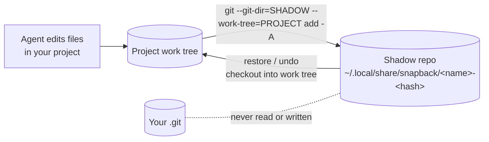

# snapback

Roll back whatever a coding agent did to your files with one command, without touching your own git history.

snapback snapshots your project before and during an agent's work: edits, deletions, new files, and the side effects of shell commands the agent ran. It works with any agent (Codex, Claude Code, OpenCode, Cursor, Aider, DeepSeek Harness, or a script you wrote) because it watches files, not the agent.

[](https://github.com/Abelo9996/snapback/actions/workflows/ci.yml)

## Quickstart

Requires Node 20 or newer and git on your PATH.

```bash
# Run your agent between two checkpoints
npx github:Abelo9996/snapback wrap -- codex

# Didn't like the result? See what it changed, then roll it back
npx github:Abelo9996/snapback diff
npx github:Abelo9996/snapback undo
```

`undo` shows the files it will restore and delete and asks before changing anything. To stop typing `npx github:...`, install it once:

```bash
npm install -g github:Abelo9996/snapback
snapback undo
```

## Safety: what it touches and what it never touches

snapback writes to:

- **Its own storage directory**, one shadow git repository per project:
  - Linux: `$XDG_DATA_HOME/snapback/` (default `~/.local/share/snapback/`)
  - macOS: `~/Library/Application Support/snapback/`
  - Windows: `%LOCALAPPDATA%\snapback\`
  - Override with `SNAPBACK_HOME`.
- **Files in your project, only when you run `undo` or `restore`**, and only after showing you the list and getting a yes (or `--yes`). Before every restore it records a safety snapshot of the current files, so a restore can itself be undone.
- **`.claude/settings.json`, only when you run `snapback hooks install`**. Existing settings are merged, never replaced, and the previous file is copied to `settings.json.snapback-backup-<timestamp>` first.

snapback never touches:

- Your project's `.git` directory: no commits, branches, tags, index changes, stashes or config. Every git call uses an explicit `--git-dir` pointing at the shadow repository, and inherited `GIT_*` environment variables are stripped. The test suite hashes every file in `.git` before and after a full snapshot, restore, undo and gc cycle and requires them to be identical.
- Files your `.gitignore` excludes, and the built-in ignores: `node_modules/`, `.venv/`, `venv/`, `__pycache__/`, `dist/`, `build/`, `out/`, `target/`, `.next/`, `.nuxt/`, `.svelte-kit/`, `.turbo/`, `.cache/`, `coverage/`, `.gradle/`, `.terraform/` and a few others (see `BUILTIN_IGNORES` in `src/store.ts`). These are never saved, so a restore never deletes or overwrites them.
- Anything outside the project directory. snapback refuses to run with your home directory or a filesystem root as the project.

## How it works



Each snapshot is a commit in the shadow repository. Its tree is the full set of non-ignored files at that moment, so restoring is exact: modified files get their old contents back, deleted files reappear, and files that did not exist in the snapshot are removed (along with directories that become empty). Unchanged files are stored once, so frequent snapshots are cheap.

Every snapshot has a kind. `undo` rolls back to the newest "before" marker whose files differ from what you have now:

| Kind | Recorded by | Marks the start of a burst |
| --- | --- | --- |
| `manual` | `snapback snap` | yes |
| `wrap-start`, `wrap`, `wrap-end` | `snapback wrap` | `wrap-start` |
| `turn-start`, `pre-tool`, `post-tool` | Claude Code hooks | `turn-start` (each prompt you send) |
| `watch-start`, `watch` | `snapback watch` | yes, each debounced burst |
| `safety`, `restore` | `undo` and `restore` | `restore` |

Running `undo` twice walks back two bursts. To reverse an undo, run the `snapback restore <id>` command it printed.

## Setup per agent

| Agent | Setup | Granularity of `undo` |
| --- | --- | --- |
| Claude Code | `snapback hooks install --agent claude` | the last prompt's changes; every Edit, Write, MultiEdit, NotebookEdit, Bash and PowerShell call is also checkpointed |
| Codex CLI | `snapback wrap -- codex` | the whole session, plus a snapshot every 30 s while it runs |
| OpenCode, Aider, Gemini CLI, any CLI agent | `snapback wrap -- <command>` | the whole session |
| Cursor, IDE agents, anything else | `snapback watch` in a terminal | each burst of changes (1.5 s of quiet ends a burst) |

### Claude Code

```bash
snapback hooks install --agent claude          # writes .claude/settings.json
snapback hooks install --agent claude --local  # or .claude/settings.local.json (not committed)
snapback hooks status
snapback hooks uninstall
```

The hooks run `snapback hook claude` on `UserPromptSubmit`, `PreToolUse` and `PostToolUse`. The hook always exits 0 and prints nothing to stdout, so it can never block a tool call or inject text into the conversation. If snapback is not installed globally, the hook command points at the absolute path of the copy you ran; `npm install -g` first gives a portable `snapback hook claude` command. Use `--command <cmd>` to set it yourself.

Claude Code's built-in rewind covers edits made through its own file tools. snapback also covers files changed by shell commands (`rm`, codemods, formatters, generators) and works the same way across every agent you use.

### Agent Skill

`skills/snapback/SKILL.md` teaches an agent to checkpoint before risky edits and how to roll back. Install it with:

```bash
npx skills add Abelo9996/snapback
```

## Commands

```text
snapback snap [-m label]               take a snapshot now
snapback list [-n 20] [--all] [--json] list snapshots, newest first
snapback diff                          what `undo` would revert
snapback diff <id> [<id2>] [--stat]    compare a snapshot with now, or two snapshots
snapback undo [--dry-run] [--yes]      roll back the last agent burst
snapback restore <id> [--yes] [-- <paths>...]
                                       restore everything, or only some paths
snapback watch [--debounce 1500]       snapshot on file changes
snapback wrap [--interval 30] -- <cmd> checkpoint, run cmd, checkpoint
snapback hooks install|uninstall|status --agent claude [--local]
snapback gc [--keep 100] [--keep-days 14] [--yes]
snapback status
```

All commands accept `--dir <path>`. By default the project is the nearest directory that already has snapshots, else the nearest git root, else the current directory.

Extra ignore patterns go in a `.snapbackignore` file at the project root (gitignore syntax). It is applied after the built-in list, so `!build/` there re-includes a built-in ignore.

## Limitations

- **Only files in the project are covered.** Database writes, network calls, deployed infrastructure, global package installs, pushed commits and messages sent cannot be undone by restoring files.
- Ignored files are not snapshotted. If an agent damages something in `node_modules/` or another ignored path, reinstall or rebuild it.
- Nested git repositories inside the project are recorded only as a pointer to their current commit, not their file contents; nested repositories with no commits are skipped.
- File watching (`watch`) can miss changes on network filesystems and some container mounts.
- Large binary files are stored in full each time they change. Run `snapback gc` to prune old snapshots; ids of the remaining snapshots change after gc.
- On Windows, `wrap` runs the command through the shell so `.cmd` shims resolve; quote arguments accordingly.
- Agent detection in `watch` labels is a best-effort scan of the process list.

## Roadmap

- Hook integrations for more agents as they ship hook APIs (Codex, OpenCode, Cursor).
- `snapback undo --interactive` to pick files from the last burst.
- Size limits for large binaries.
- A `snapback log --agent <name>` filter and per-session grouping.

## Related projects

snapback is part of a small set of tools for evaluating and living with coding agents:

- [nerfwatch](https://github.com/Abelo9996/nerfwatch): detects silent model and cost changes behind an API.
- [rerunbench](https://github.com/Abelo9996/rerunbench): measures how consistent an agent is across reruns of the same task.

## Contributing

See [CONTRIBUTING.md](CONTRIBUTING.md). Bug reports with a reproduction in a temp directory are the most useful kind.

## License

MIT. See [LICENSE](LICENSE).
