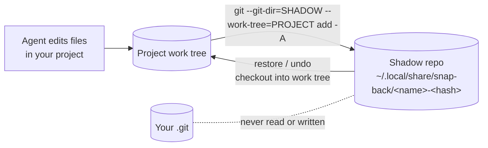

# snap-back

[English](README.md) | 简体中文

一条命令撤销编程智能体对你文件做的所有改动，而且不会碰你自己的 git 历史。

snap-back 会在智能体开始工作前和工作过程中给项目拍快照：编辑、删除、新建的文件，以及智能体执行 shell 命令带来的副作用，都会被记录下来。它适用于任何智能体（Codex、Claude Code、OpenCode、Cursor、Aider、DeepSeek Harness，或者你自己写的脚本），因为它盯的是文件，而不是智能体本身。

[](https://github.com/Abelo9996/snap-back/actions/workflows/ci.yml)


## 快速开始

需要 Node 20 或更高版本，并且 PATH 中能找到 git。

```bash
# Run your agent between two checkpoints
npx @abelo9996/snap-back wrap -- codex

# Didn't like the result? See what it changed, then roll it back
npx @abelo9996/snap-back diff
npx @abelo9996/snap-back undo
```

`undo` 会先列出将要恢复和删除的文件，确认之后才会做任何改动。如果不想每次都输入 `npx @abelo9996/snap-back ...`，可以全局安装一次：

```bash
npm install -g @abelo9996/snap-back
snap-back undo
```

Homebrew（macOS 和 Linux）：`brew install abelo9996/tap/snap-back` 会安装同一个 `snap-back` 命令。

## 作为 Claude Code 插件安装

在 Claude Code 里运行：

```text
/plugin marketplace add Abelo9996/open-agent-lab
/plugin install snap-back@open-agent-lab
```

然后运行 `/reload-plugins` 或开一个新会话。插件会加入 snap-back skill，命令 `/snap-back:undo`（先预览，再回滚最近一段改动或指定的快照 id）、`/snap-back:list` 和 `/snap-back:status`，以及和 `snap-back hooks install` 写入的相同的 `UserPromptSubmit`、`PreToolUse`、`PostToolUse` hook，不需要改任何 settings 文件。装了插件就不要再运行 `snap-back hooks install`，否则两套 hook 会同时运行。在终端里也可以：`claude plugin marketplace add Abelo9996/open-agent-lab`，然后 `claude plugin install snap-back@open-agent-lab`。需要 Claude Code 2.1.139 或更新版本、Node 20+ 和 git。

hook 不需要额外安装：没有全局安装时，它通过 `npx -y @abelo9996/snap-back` 运行，第一次使用时会下载这个包。在一台 Apple M 系列笔记本上实测，经由 npx 每次 hook 调用约 0.5 秒；全局安装后约 0.2 秒，插件只要在 PATH 里找到 snap-back 就会自动使用它：

```bash
npm install -g @abelo9996/snap-back
```

每次会改文件的工具调用只需等待一个 hook，调用之后的那次快照在后台运行。

## 作为 Codex 插件安装

```bash
codex plugin marketplace add Abelo9996/open-agent-lab
codex plugin add snap-back@open-agent-lab
```

这会加入 snap-back skill，让 Codex 在有风险的改动之前打检查点，并在你要求时回滚。Codex 目前还没有 snap-back 的 hook；要在整个会话前后自动打检查点，用 `snap-back wrap -- codex` 启动它。

## 安全性：会动什么，绝不会动什么

snap-back 会写入：

- **它自己的存储目录**，每个项目对应一个影子 git 仓库（shadow repository）：
  - Linux：`$XDG_DATA_HOME/snap-back/`（默认为 `~/.local/share/snap-back/`）
  - macOS：`~/Library/Application Support/snap-back/`
  - Windows：`%LOCALAPPDATA%\snap-back\`
  - 可以用 `SNAP_BACK_HOME` 覆盖（仍然兼容读取 `SNAPBACK_HOME`）。
  - 如果该位置已经存在改名之前版本留下的 `snapback` 目录，会继续沿用它，已有的快照依然可用。
- **项目里的文件，仅在你运行 `undo` 或 `restore` 时**，并且只会在列出文件清单、得到你的确认（或传入 `--yes`）之后才写入。每次恢复之前，它都会先给当前文件记录一个安全快照，所以恢复操作本身也可以撤销。恢复绝不会删除快照因忽略规则而没有记录的文件：如果智能体改写了 `.gitignore`，让 `.env` 变得可见，`undo` 会恢复 `.gitignore`，并把 `.env` 列为保留。如果你在拍快照或恢复的过程中按下 Ctrl-C，snap-back 会先把它完成，所以项目绝不会停在恢复了一半的状态。
- **`.claude/settings.local.json`，仅在你运行 `snap-back hooks install` 时**（加 `--shared` 时则是 `.claude/settings.json`）。已有的设置会被合并而不是覆盖，并且原文件会先被复制为 `<file>.snap-back-backup-<timestamp>`。

snap-back 绝不会碰：

- 项目的 `.git` 目录：不会产生 commit、分支、tag、index 变更、stash，也不会改配置。每一次 git 调用都通过显式的 `--git-dir` 指向影子仓库，并且会清除继承下来的 `GIT_*` 环境变量。测试套件会在一整轮快照、恢复、撤销和 gc 前后，对 `.git` 中的每个文件计算哈希，并要求前后完全一致。
- 被 `.gitignore` 排除的文件，以及内置忽略的目录（和 `.gitignore` 规则一样，在任意层级都匹配）：`node_modules/`、`.venv/`、`venv/`、`__pycache__/`、`dist/`、`build/`、`out/`、`target/`、`.next/`、`.nuxt/`、`.svelte-kit/`、`.turbo/`、`.cache/`、`coverage/`、`.gradle/`、`.terraform/` 等（完整列表见 `src/store.ts` 中的 `BUILTIN_IGNORES`）。这些内容从不保存，因此恢复时也绝不会删除或覆盖它们。
- 项目目录之外的任何东西。如果把主目录或文件系统根目录当作项目，snap-back 会拒绝运行。

## 工作原理



每个快照都是影子仓库里的一个 commit。它的 tree 就是当时所有未被忽略文件的完整集合，所以恢复是精确的：被修改的文件回到原来的内容，被删除的文件重新出现，快照里不存在的文件会被删除（变空的目录也会一起删除）。没有变化的文件只存一份，所以频繁拍快照的成本很低。

每个快照都有一个类型（kind）。`undo` 会回滚到最近一个文件内容与你当前不同的 “before” 标记：

| 类型 | 由谁记录 | 哪个类型标志一段改动的开始 |
| --- | --- | --- |
| `manual` | `snap-back snap` | 是 |
| `wrap-start`、`wrap`、`wrap-end` | `snap-back wrap` | `wrap-start` |
| `turn-start`、`pre-tool`、`post-tool` | Claude Code hooks | `turn-start`（你每发送一条 prompt） |
| `watch-start`、`watch` | `snap-back watch` | 是，每段防抖后的改动都算 |
| `safety`、`restore` | `undo` 和 `restore` | `restore` |

连续运行两次 `undo` 会往回退两段改动。如果已经没有更早的改动，`undo` 会直接说明并且不做任何改动，绝不会把上一次 `undo` 撤掉的内容重新应用回来。想撤销一次 `undo`，运行它打印出来的那条 `snap-back restore <id>` 命令即可。

## 各智能体的配置

| 智能体 | 配置方式 | `undo` 的粒度 |
| --- | --- | --- |
| Claude Code | [插件](#作为-claude-code-插件安装)，或 `snap-back hooks install --agent claude` | 上一条 prompt 带来的改动；每次 Edit、Write、MultiEdit、NotebookEdit、Bash 和 PowerShell 调用也都会打检查点 |
| Codex CLI | `snap-back wrap -- codex` | 整个会话，运行期间每 30 秒额外拍一次快照 |
| OpenCode、Aider、Gemini CLI，以及任何 CLI 智能体 | `snap-back wrap -- <command>` | 整个会话 |
| Cursor、IDE 内的智能体，以及其他任何工具 | 在终端里运行 `snap-back watch` | 每一段改动（安静 1.5 秒即视为一段结束） |

### Claude Code

```bash
snap-back hooks install --agent claude           # writes .claude/settings.local.json
snap-back hooks install --agent claude --shared  # writes .claude/settings.json instead
snap-back hooks status                           # reports both files
snap-back hooks uninstall                        # removes the hooks from both files
```

这些 hooks 会在 `UserPromptSubmit`、`PreToolUse` 和 `PostToolUse` 时运行 `snap-back hook claude`。hook 总是以 0 退出，并且不往 stdout 输出任何内容，所以它既不会阻断工具调用，也不会往对话里注入文本。

默认情况下 hooks 写入 `.claude/settings.local.json`，这个文件存放的是你的个人设置，本来就不应该提交。如果 git 把它列为未跟踪文件，把它加进 `.gitignore` 即可。如果希望项目里的每个人都启用这些 hooks，用 `--shared` 写入 `.claude/settings.json`，这个文件通常是会提交到仓库里的。

如果 snap-back 没有全局安装，hook 命令会指向你当时运行的那份副本的绝对路径（如果用的是 `npx`，就是 npx 缓存里的某个目录）。这个路径只在你自己的机器上存在，所以这种情况下 `--shared` 会打印一条警告。请先运行 `npm install -g @abelo9996/snap-back`，拿到可移植的 `snap-back hook claude` 命令，再安装 hooks。也可以用 `--command <cmd>` 自己指定命令。

`uninstall` 可以加 `--shared` 或 `--local`，只清理其中一个文件。重新安装时，会替换掉之前用其他命令安装的 hook 条目，包括改名之前的 `snapback hook claude` 写法。

Claude Code 内置的 rewind 只覆盖通过它自己的文件工具做出的编辑。snap-back 还能覆盖 shell 命令改动的文件（`rm`、codemod、格式化工具、代码生成器），并且在你使用的每一个智能体上表现都一样。

### Agent Skill

`skills/snap-back/SKILL.md` 会教智能体在进行有风险的编辑之前先打检查点，以及如何回滚。安装方法：

```bash
npx skills add Abelo9996/snap-back
```

## 命令

```text
snap-back snap [-m label]               take a snapshot now
snap-back list [-n 20] [--all] [--json] list snapshots, newest first
snap-back diff                          what `undo` would revert
snap-back diff <id> [<id2>] [--stat]    compare a snapshot with now, or two snapshots
snap-back undo [--dry-run] [--yes]      roll back the last agent burst
snap-back restore <id> [--yes] [-- <paths>...]
                                       restore everything, or only some paths
snap-back watch [--debounce 1500]       snapshot on file changes
snap-back wrap [--interval 30] -- <cmd> checkpoint, run cmd, checkpoint
snap-back hooks install|uninstall|status --agent claude [--shared|--local]
snap-back gc [--keep 100] [--keep-days 14] [--yes]
snap-back status
```

所有命令都支持 `--dir <path>`。默认情况下，从当前目录开始逐级向上，第一个已有快照或包含 `.git` 的目录就是项目目录；如果都没有，就是当前目录。当项目目录不是当前目录时，`undo`、`restore` 和 `wrap` 会把它打印出来。

额外的忽略规则写在项目根目录的 `.snap-back-ignore` 文件里（语法与 gitignore 相同）。它在内置列表之后生效，所以在里面写 `!build/` 就能把某个内置忽略项重新包含进来。改名之前的 `.snapbackignore` 文件仍然会被读取。

## 局限性

- **只覆盖项目里的文件。** 数据库写入、网络请求、已部署的基础设施、全局安装的包、已经 push 的 commit 和已经发出的消息，都无法通过恢复文件来撤销。
- `undo` 会撤销它所选标记之后的所有文件改动，包括智能体结束后你手动做的编辑。它会先列出文件，并且它记录的安全快照会保留你的编辑，所以用 `snap-back restore <safety-id> -- <path>` 可以把其中任何一个找回来。
- 被忽略的文件不会拍快照。如果智能体弄坏了 `node_modules/` 或其他被忽略路径里的东西，重新安装或重新构建即可。
- 项目内嵌套的 git 仓库只会记录一个指向其当前 commit 的指针，不会记录文件内容；没有任何 commit 的嵌套仓库会被跳过。`undo` 和 `restore` 会把有变化的嵌套仓库列为跳过，而不会去动它们；如果智能体删除或改写了某个嵌套仓库，请用它自己的 git 历史来恢复。
- 文件监听（`watch`）在网络文件系统和部分容器挂载上可能会漏掉改动。
- 大的二进制文件每次变化都会完整存储一份。运行 `snap-back gc` 可以清理旧快照；gc 之后，剩余快照的 id 会发生变化。
- 在 Windows 上，`wrap` 通过 shell 执行命令，以便正确解析 `.cmd` 包装脚本（shim）；参数请相应地加引号。
- `watch` 标签中的智能体识别是对进程列表的尽力而为（best-effort）扫描。

## 路线图

- 随着更多智能体提供 hook API（Codex、OpenCode、Cursor），为它们加上 hook 集成。
- `snap-back undo --interactive`，从上一段改动里挑选要恢复的文件。
- 为大的二进制文件设置大小上限。
- `snap-back log --agent <name>` 过滤器，以及按会话分组。

## 相关项目

snap-back 属于一组用于评估编程智能体、并与之长期共处的小工具：

- [nerf-watch](https://github.com/Abelo9996/nerf-watch)：检测 API 背后悄无声息的模型变化和成本变化。
- [rerun-bench](https://github.com/Abelo9996/rerun-bench)：衡量智能体在多次重跑同一任务时有多稳定。

## 参与贡献

参见 [CONTRIBUTING.md](CONTRIBUTING.md)。最有用的是附带复现步骤（在临时目录中复现）的 bug 报告。

## 许可证

MIT。参见 [LICENSE](LICENSE)。

如本文与英文版 [README](README.md) 有出入，以英文版为准。
